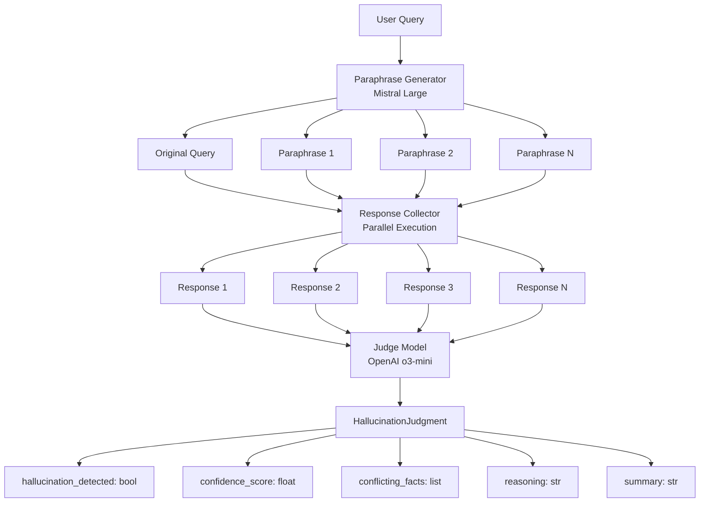

## Overview

PAS2 detects hallucinations by exploiting a fundamental property of language models: when an LLM lacks knowledge or hallucinates, it often provides inconsistent answers to semantically equivalent questions.

<Info>
The core principle: A confident, knowledgeable model should give consistent factual answers regardless of how the question is phrased.
</Info>

## Three-phase detection process

PAS2 uses a three-phase approach implemented in the `detect_hallucination` method:

```python
# From pas2.py lines 222-300
def detect_hallucination(self, query: str, n_paraphrases: int = 3) -> Dict:
    """
    Detect hallucinations by comparing responses to paraphrased queries
    using a judge model
    """
    # Phase 1: Generate paraphrases
    all_queries = self.generate_paraphrases(query, n_paraphrases)
    
    # Phase 2: Get responses to all queries
    all_responses = []
    for i, q in enumerate(all_queries):
        response = self._get_single_response(q, index=i)
        all_responses.append(response)
    
    # Phase 3: Judge the responses for hallucinations
    judgment = self.judge_hallucination(
        original_query=all_queries[0],
        original_response=all_responses[0],
        paraphrased_queries=all_queries[1:],
        paraphrased_responses=all_responses[1:]
    )
```

<Steps>
  <Step title="Generate paraphrases">
    Mistral Large creates semantically equivalent variations of the input query while preserving the original meaning.
  </Step>
  <Step title="Collect responses">
    Each paraphrase is sent to Mistral Large independently. Responses are collected in parallel for efficiency.
  </Step>
  <Step title="Judge consistency">
    OpenAI's o3-mini analyzes all responses to identify factual inconsistencies and assign a confidence score.
  </Step>
</Steps>

## Phase 1: Paraphrase generation

PAS2 uses Mistral Large with JSON mode to generate high-quality paraphrases:

```python
# From pas2.py lines 63-120
def generate_paraphrases(self, query: str, n_paraphrases: int = 3) -> List[str]:
    """Generate paraphrases of the input query using Mistral API"""
    messages = [
        {
            "role": "system",
            "content": f"You are an expert at creating semantically equivalent "
                       f"paraphrases. Generate {n_paraphrases} different paraphrases "
                       f"of the given query that preserve the original meaning but "
                       f"vary in wording and structure. Return a JSON array of strings, "
                       f"each containing one paraphrase."
        },
        {
            "role": "user",
            "content": query
        }
    ]
    
    response = self.mistral_client.chat.complete(
        model=self.mistral_model,  # "mistral-large-latest"
        messages=messages,
        response_format={"type": "json_object"}
    )
```

### Paraphrase examples

For the query "Who was the first person to land on the moon?", Mistral might generate:

1. "Who became the initial individual to set foot on the lunar surface?"
2. "Which person achieved the first moon landing?"
3. "Who was the inaugural astronaut to walk on the moon?"

Each variation:
- Preserves the core semantic meaning
- Uses different vocabulary and sentence structure
- Targets the same factual information

<Note>
The system includes fallback paraphrases if the API fails, ensuring robustness:

```python
fallback_paraphrases = [
    query,
    f"Could you tell me about {query.strip('?')}?",
    f"I'd like to know: {query}",
    f"Please provide information on {query.strip('?')}."
]
```
</Note>

## Phase 2: Parallel response collection

PAS2 collects responses efficiently using parallel API calls:

```python
# From pas2.py lines 174-220
def get_responses(self, queries: List[str]) -> List[str]:
    """Get responses from Mistral API for each query in parallel"""
    # Use ThreadPoolExecutor for parallel API calls
    with ThreadPoolExecutor(max_workers=min(len(queries), 5)) as executor:
        # Submit tasks and map them to their original indices
        future_to_index = {
            executor.submit(self._get_single_response, query, i): i 
            for i, query in enumerate(queries)
        }
        
        # Prepare a list with the correct length
        responses = [""] * len(queries)
        
        # Collect results as they complete
        for future in concurrent.futures.as_completed(future_to_index):
            index = future_to_index[future]
            responses[index] = future.result()
```

### Why parallel processing matters

<CardGroup cols={2}>
  <Card title="Sequential (4 queries)" icon="clock">
    4 queries × 2s each = **8 seconds**
  </Card>
  <Card title="Parallel (4 queries)" icon="gauge-high">
    Max of all queries ≈ **2 seconds**
  </Card>
</CardGroup>

<Info>
PAS2 limits parallel workers to 5 to prevent API rate limiting while maintaining speed benefits.
</Info>

### Response consistency patterns

**No hallucination example:**
```
Q1: "Who was the first person on the moon?"
A1: "Neil Armstrong was the first person to walk on the moon on July 20, 1969."

Q2: "Who made the initial lunar landing?"
A2: "Neil Armstrong became the first human to step onto the moon in 1969."

Q3: "Which astronaut first walked on the moon?"
A3: "The first person to walk on the moon was Neil Armstrong during Apollo 11."

→ Consistent core fact: Neil Armstrong, 1969
```

**Hallucination example:**
```
Q1: "What color was Napoleon's white horse?"
A1: "Napoleon's white horse was white, as suggested by the question."

Q2: "What was the color of Napoleon's famous horse?"
A2: "Napoleon's most famous horse, Marengo, was gray."

Q3: "Describe Napoleon's horse color?"
A3: "Napoleon rode a white horse named Vizir during many campaigns."

→ Conflicting facts: white vs. gray, different horse names
```

## Phase 3: Model-as-judge analysis

The judge model (OpenAI o3-mini) evaluates all responses for factual consistency:

```python
# From pas2.py lines 302-377
def judge_hallucination(self, 
                       original_query: str, 
                       original_response: str, 
                       paraphrased_queries: List[str], 
                       paraphrased_responses: List[str]) -> HallucinationJudgment:
    """Use OpenAI's o3-mini as a judge to detect hallucinations"""
    
    # Prepare context for the judge
    context = f"""
Original Question: {original_query}

Original Response: 
{original_response}

Paraphrased Questions and their Responses:
"""
    
    for i, (query, response) in enumerate(zip(paraphrased_queries, paraphrased_responses), 1):
        context += f"\nParaphrased Question {i}: {query}\n\nResponse {i}:\n{response}\n"
    
    system_prompt = """
You are a judge evaluating whether an AI is hallucinating across different 
responses to semantically equivalent questions.
Analyze all responses carefully to identify any factual inconsistencies or 
contradictions.
Focus on factual discrepancies, not stylistic differences.
"""
```

### Judge output structure

The judge returns a structured `HallucinationJudgment` with five fields:

```python
class HallucinationJudgment(BaseModel):
    hallucination_detected: bool = Field(
        description="Whether a hallucination is detected across the responses"
    )
    confidence_score: float = Field(
        description="Confidence score between 0-1 for the hallucination judgment"
    )
    conflicting_facts: List[Dict[str, Any]] = Field(
        description="List of conflicting facts found in the responses"
    )
    reasoning: str = Field(
        description="Detailed reasoning for the judgment"
    )
    summary: str = Field(
        description="A summary of the analysis"
    )
```

### Example judge output

```json
{
  "hallucination_detected": true,
  "confidence_score": 0.87,
  "conflicting_facts": [
    {
      "topic": "Moon landing date",
      "response_1": "July 20, 1969",
      "response_2": "July 21, 1969",
      "discrepancy": "Different dates provided for the same event"
    }
  ],
  "reasoning": "While all responses correctly identify Neil Armstrong as the first person on the moon, there is an inconsistency in the date. Response 1 states July 20, 1969, while Response 2 claims July 21, 1969. This temporal inconsistency indicates potential hallucination or timezone confusion.",
  "summary": "Factual inconsistency detected in the date of the moon landing across responses."
}
```

<Warning>
The judge focuses on **factual discrepancies**, not stylistic variations. Differences in:
- Word choice
- Sentence structure
- Level of detail

are considered acceptable as long as core facts remain consistent.
</Warning>

## Why this approach works

### Advantages

<CardGroup cols={2}>
  <Card title="No ground truth needed" icon="magnifying-glass">
    Detects hallucinations without requiring external fact-checking databases
  </Card>
  <Card title="Model-agnostic" icon="robot">
    Works with any LLM that generates text responses
  </Card>
  <Card title="Contextual understanding" icon="brain">
    The judge model understands context and semantic equivalence
  </Card>
  <Card title="Explainable results" icon="message-lines">
    Provides detailed reasoning for each detection decision
  </Card>
</CardGroup>

### Limitations

1. **API costs**: Each detection requires N+2 API calls (1 for paraphrasing, N for responses, 1 for judging)
2. **Latency**: Even with parallelization, total time depends on slowest API call
3. **Consistent hallucinations**: If the model hallucinates the same false fact consistently, detection may fail
4. **Ambiguous questions**: Questions with multiple valid interpretations may trigger false positives

<Note>
For questions where multiple correct answers exist ("Name a country in Europe"), PAS2 may incorrectly flag valid variations as hallucinations. Use single-answer factual queries for best results.
</Note>

## Architecture diagram



## Performance characteristics

### Time complexity

- **Paraphrase generation**: O(1) - Single API call
- **Response collection**: O(1) with parallelization - Limited by slowest response
- **Judgment**: O(1) - Single API call analyzing all responses

**Total time**: Typically 5-15 seconds for 3-5 paraphrases

### Token usage

For a query with 3 paraphrases:

1. **Paraphrase generation**: ~500 tokens (input + output)
2. **Response collection**: ~2000 tokens (4 queries × ~500 tokens each)
3. **Judgment**: ~3000 tokens (all responses + context + analysis)

**Total**: ~5500 tokens per detection

<Info>
Token usage scales linearly with the number of paraphrases. Use fewer paraphrases for cost optimization or more for higher accuracy.
</Info>

## Next steps

<CardGroup cols={2}>
  <Card title="Quick start" icon="rocket" href="/quickstart">
    Run your first hallucination detection
  </Card>
  <Card title="API reference" icon="code" href="/api/pas2-class">
    Explore all methods and parameters
  </Card>
  <Card title="Configuration" icon="sliders" href="/guides/configuration">
    Customize models and thresholds
  </Card>
  <Card title="Performance tuning" icon="star" href="/advanced/performance-tuning">
    Tips for optimal detection accuracy
  </Card>
</CardGroup>